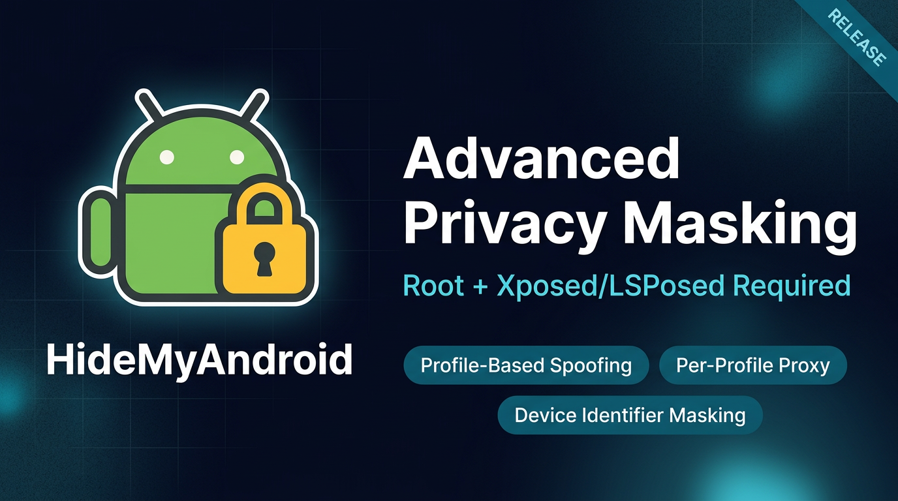

# HideMyAndroid

 

## English

[English](#english) | [简体中文](#zh-cn)

### Support/Discussion

Support: https://t.me/wowareofficial

HideMyAndroid is a privacy-focused Android module built to reduce app tracking and device fingerprinting through profile-based masking/spoofing.

Official Website: https://www.hidemyandroid.com  
Web App / Dashboard: https://app.hidemyandroid.com  
How to install: https://www.hidemyandroid.com/en/how-to-install/

### Requirements

- Android 9.0+ (Pie or newer)
- Rooted Android device
- Properly working Xposed/LSPosed environment
- If you are not familiar with Xposed modules, this project may not be suitable for your setup.

### How It Works

When a target app requests identifiers or environment signals, HideMyAndroid intercepts the request and returns configured spoofed values based on your selected profile.

### Feature List

- Hide Device Identifiers (Android ID, GAID, GSF ID, Widevine DRM ID, IMEI, Serial, ...)
- Hide VPN Connection
- Hide Active Proxy Connection from Apps
- Browser Fingerprint
- Hide Airplane Mode
- Hide Wi-Fi Information (NAME/MAC)
- Spoof Nearby Wi-Fi Networks
- Spoof Nearby Bluetooth Devices
- Block LAN Scan
- Hide Developer Mode
- Spoof Play Store Installation
- Spoof Timezone Based on IP
- Spoof Region Based on IP
- Spoof GPS Location Based on IP
- Spoof App Identity
- Isolated Account Environment
- Virtual Gmail Accounts Per Profile
- Hide Installed Applications
- Realistic Sensor Data
- Device Simulation
- Profile-Based System
- Backup & Restore app's data
- Per-Profile Proxy (each profile can use its own independent proxy configuration)
- Hide Suspicious Keyboards
- Virtual Default Keyboard Value
- Many More Features

### Free vs Premium

| Features                                          | Freemium | Premium (Subscription) |
| ------------------------------------------------- | :------: | :--------------------: |
| Hide device identifiers (partial/full by plan)    |    ✅    |           ✅           |
| Backup & restore app data                         |    ✅    |           ✅           |
| Hide active VPN from apps                         |    ✅    |           ✅           |
| Spoof Wi-Fi SSID/BSSID                            |    ✅    |           ✅           |
| Hide Developer Options state                      |    ✅    |           ✅           |
| Spoof installer as Google Play                    |    ✅    |           ✅           |
| Hide installed apps list                          |    ✅    |           ✅           |
| Hide suspicious keyboards from enabled keyboard lists |    ✅    |           ✅           |
| Virtual default keyboard value spoofing           |    ✅    |           ✅           |
| Device Simulation                                 |    ✅    |           ✅           |
| Hide active proxy connection from apps            |          |           ✅           |
| Browser Fingerprint                               |          |           ✅           |
| Hide airplane mode state from apps               |          |           ✅           |
| Spoof nearby Wi-Fi networks                       |          |           ✅           |
| Spoof nearby Bluetooth devices                    |          |           ✅           |
| Block private LAN scan behavior                   |          |           ✅           |
| Spoof timezone by geo                             |          |           ✅           |
| Spoof locale/region by geo                        |          |           ✅           |
| Spoof GPS by geo                                  |          |           ✅           |
| Spoof app identity                                |          |           ✅           |
| Virtual Gmail accounts per profile                |          |           ✅           |
| Virtual account isolation per profile             |          |           ✅           |
| Realistic sensor behavior                         |          |           ✅           |

### Important Notice

System-level modification always carries risk.  
Please back up your ROM and important data before use.

### Disclaimer

Use at your own risk.  
By installing or using HideMyAndroid, you are solely responsible for how you use it.  
The developers are not responsible for misuse, violations of laws/platform policies, account penalties, data loss, instability, or bootloops.

### Ongoing Updates

HideMyAndroid is actively maintained with continuous feature and stability updates.

### Feature Requests

Feature requests are welcome.  
If you need a specific capability, share your use case and we will prioritize based on community demand.

---

## 简体中文

[English](#english) | [简体中文](#zh-cn)

### 支持与讨论

Support: https://t.me/wowareofficial

HideMyAndroid 是一款以隐私保护为核心的 Android 模块。它通过基于配置文件的隐藏与伪装机制，降低应用跟踪和设备指纹识别风险。

官方网站: https://www.hidemyandroid.com  
Web 应用 / 控制台: https://app.hidemyandroid.com  
安装教程: https://www.hidemyandroid.com/zh/how-to-install/

### 使用要求

- Android 9.0+（Pie 或更高版本）
- 已 Root 的 Android 设备
- 可正常运行的 Xposed/LSPosed 环境
- 如果你不熟悉 Xposed 模块，本项目可能不适合你的设备环境。

### 工作机制

当目标应用请求设备标识符或环境信号时，HideMyAndroid 会拦截请求，并根据你选择的配置文件返回已设置的伪装值。

### 功能一览

- 隐藏设备标识符（Android ID、GAID、GSF ID、Widevine DRM ID、IMEI、Serial 等）
- 隐藏 VPN 连接状态
- 对应用隐藏当前代理连接状态
- 浏览器指纹
- 隐藏飞行模式状态
- 隐藏 Wi-Fi 信息（名称/MAC）
- 伪造附近 Wi-Fi 网络
- 伪造附近蓝牙设备
- 阻止局域网扫描
- 隐藏开发者模式状态
- 伪装为通过 Play 商店安装
- 基于 IP 伪装时区
- 基于 IP 伪装地区
- 基于 IP 伪装 GPS 位置
- 伪装应用身份
- 账号隔离环境
- 每个配置文件使用虚拟 Gmail 账号
- 隐藏已安装应用列表
- 拟真的传感器数据
- 设备模拟
- 基于配置文件的系统
- 备份与恢复应用数据
- 按配置文件设置代理（每个配置文件可使用独立代理配置）
- 隐藏可疑键盘
- 虚拟默认键盘值
- 更多功能持续更新

### 免费版 vs 高级版

| 功能                                               | 免费版 | 高级版（订阅） |
| -------------------------------------------------- | :----: | :------------: |
| 隐藏设备标识符（按套餐提供部分/全部）             |   ✅   |       ✅       |
| 备份与恢复应用数据                                 |   ✅   |       ✅       |
| 对应用隐藏当前 VPN 状态                            |   ✅   |       ✅       |
| 伪装 Wi-Fi SSID/BSSID                              |   ✅   |       ✅       |
| 隐藏开发者选项状态                                 |   ✅   |       ✅       |
| 伪装安装来源为 Google Play                         |   ✅   |       ✅       |
| 隐藏已安装应用列表                                 |   ✅   |       ✅       |
| 在已启用键盘列表中隐藏可疑键盘                     |   ✅   |       ✅       |
| 虚拟默认键盘值伪装                                 |   ✅   |       ✅       |
| 设备模拟                                           |   ✅   |       ✅       |
| 对应用隐藏当前代理连接状态                         |        |       ✅       |
| 浏览器指纹                                         |        |       ✅       |
| 对应用隐藏飞行模式状态                            |        |       ✅       |
| 伪造附近 Wi-Fi 网络                                |        |       ✅       |
| 伪造附近蓝牙设备                                   |        |       ✅       |
| 阻止私有局域网扫描行为                             |        |       ✅       |
| 按地理位置伪装时区                                 |        |       ✅       |
| 按地理位置伪装语言区域/地区                        |        |       ✅       |
| 按地理位置伪装 GPS                                 |        |       ✅       |
| 伪装应用身份                                       |        |       ✅       |
| 每个配置文件使用虚拟 Gmail 账号                    |        |       ✅       |
| 每个配置文件的虚拟账号隔离                         |        |       ✅       |
| 拟真的传感器行为                                   |        |       ✅       |

### 重要提示

系统级修改始终存在风险。  
使用前请先备份 ROM 和重要数据。

### 免责声明

请自行承担使用风险。  
安装或使用 HideMyAndroid，即表示你需对其使用方式承担全部责任。  
对于误用、违反法律/平台政策、账号处罚、数据丢失、系统不稳定或开机循环（bootloop），开发者不承担责任。

### 持续更新

HideMyAndroid 正在持续维护，并不断进行功能与稳定性更新。

### 功能建议

欢迎提交功能建议。  
如果你需要特定能力，请分享你的使用场景，我们会根据社区需求优先级进行评估。
